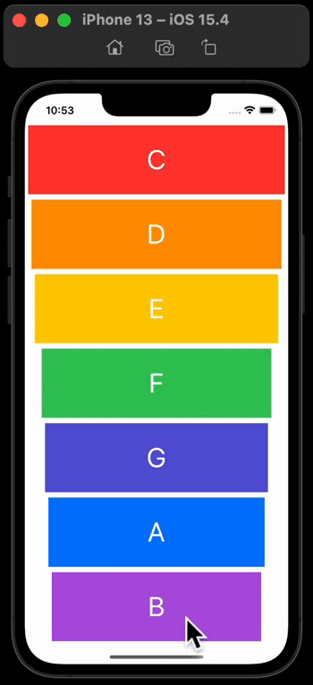

## MyXylophone

I made a colourful the musical instrument ***MyXylophone***  app. 

What I learned:

- How to play sound using AVFoundation and AVAudioPlayer.

- Functions and methods in Swift

- Data types

- Swift loops

- Variable scope

- The View Controller lifecycle

- Error handling in Swift

- Code refactoring

- Basic debugging